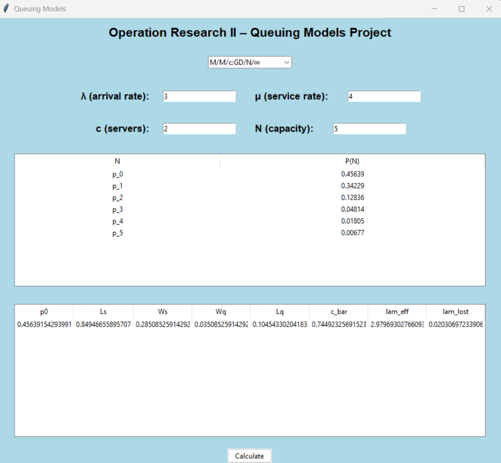

# Queueing Models KPI Calculator

A Python/Tkinter-based graphical interface to analyze multiple queueing systems and compute
key performance indicators (KPIs).

## Supported Models
- M/M/1 (infinite capacity)
- M/M/1/N (finite capacity)
- M/M/c (infinite capacity)
- M/M/c/N (finite capacity)
- M/M/∞

## Features
- User-friendly GUI for parameter input
- Automatic validation of stability conditions
- Computation of key KPIs (L, Lq, W, Wq, P0, effective arrival rate)
- Probability distribution table P(N)

## How to Run
```bash
python main.py
```
## Notes
This project focuses on applying queueing theory concepts through an interactive interface.
```md
## Interface Preview

